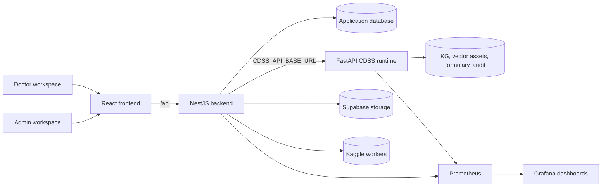

# MedCity CDSS Full System

MedCity CDSS is a full-stack clinical decision support and prescription assistance platform for modern medical workflows. It combines a React doctor/admin interface, a NestJS application backend, and an internal FastAPI CDSS runtime dedicated to clinical analysis, evidence retrieval, safety validation, localization, audit traces, and monitoring.

The system is designed around one important product rule: the frontend talks only to the NestJS API. The FastAPI CDSS service remains an internal clinical runtime consumed by NestJS through a controlled adapter.

## Platform Overview



## What This Project Provides

MedCity is more than a CRUD application. It is a complete clinical product skeleton with production-oriented boundaries, monitoring, deployment, and safety-aware prescription workflows.

| Area | Capabilities |
|---|---|
| Doctor experience | Patient records, consultations, vitals, audio processing, manual prescriptions, AI/CDSS prescription drafts, ordonnance printing, prescription review queue, safety explanations |
| Prescription workflow | Medication lines, Tunisian medicine catalog search, validation, rejection, patient/pharmacy dispatch, printable ordonnance payloads |
| CDSS integration | NestJS adapter for FastAPI draft, analysis, validation, formulary search, KG search, trace/audit retrieval, direct and Kaggle execution modes |
| Medicine data | TN Med SQLite import, product-level medicine catalog, DCI, dosage, form, lab, AMM, price, reimbursement, pregnancy and contraindication information |
| Admin experience | Doctor management, medicine catalog, contributions, CMS, public content, audit, pharmacy dispatches, monitoring entry point |
| Observability | Prometheus metrics, Grafana dashboards, optional EC2 host and Docker container metrics through node-exporter and cAdvisor |
| DevOps | Docker Compose runtime, GitHub Actions CI, GHCR image workflow, automatic EC2 deployment after successful main CI |

## Repository Layout

```text
.
|-- medcity-app/        React 19 + Vite frontend, doctor/admin/public UI
|-- backend_template/   NestJS API, TypeORM persistence, auth, CDSS adapter
|-- cdss_professional/  FastAPI CDSS runtime used internally by NestJS
|-- monitoring/         Prometheus and Grafana provisioning
|-- docs/               Architecture, contracts, and automated testing notes
|-- scripts/            Deployment and maintenance helpers
|-- docker-compose.yml  Local and EC2 multi-service stack
|-- DEVOPS.md           CI/CD, Docker, monitoring, and deployment details
`-- README.md           Project overview and operator guide
```

## Service Boundaries

| Service | Responsibility | Publicly consumed by |
|---|---|---|
| `medcity-app` | User interface for doctors, admins, and public pages | Browser users |
| `backend_template` | Product backend: auth, roles, relational data, prescriptions, audit, CMS, pharmacy, medicine catalog, CDSS adapter | Frontend only |
| `cdss_professional/...` | Clinical reasoning runtime: analysis, generation, evidence, safety, localization, trace audit | NestJS only |
| `monitoring/*` | Prometheus scrape config and Grafana dashboards | Admin/ops users |

## Local Docker Quick Start

Docker Compose is the recommended way to run the full system because it starts the frontend, NestJS API, FastAPI CDSS, PostgreSQL, LibreTranslate, Prometheus, and Grafana together.

```bash
cp .env.example .env
docker compose up -d --build
```

PowerShell equivalent:

```powershell
Copy-Item .env.example .env
docker compose up -d --build
```

Default local URLs:

| Service | URL |
|---|---|
| Frontend | `http://localhost:5173` |
| NestJS API | `http://localhost:3000/api` |
| FastAPI CDSS | `http://localhost:8000` |
| LibreTranslate | `http://localhost:5000` |
| Prometheus | `http://localhost:9090` |
| Grafana direct port | `http://localhost:3001` |
| Grafana via frontend proxy | `http://localhost:5173/grafana/` |

The Docker CDSS service boots with stub/demo backends by default so the stack can run without large clinical model assets. For real clinical runtime validation, mount the production CDSS assets and replace the CDSS environment values.

## Development Without Docker

Use Docker for the full stack. For focused frontend or backend development, the services can also be run separately.

Frontend:

```bash
npm --prefix medcity-app install
npm --prefix medcity-app run dev
```

NestJS backend:

```bash
npm --prefix backend_template install
npm --prefix backend_template run seed
npm --prefix backend_template run start:dev
```

Useful backend scripts:

```bash
npm --prefix backend_template run build
npm --prefix backend_template run test:api-crud
npm --prefix backend_template run test:clinical-crud
npm --prefix backend_template run import:tn-med
```

## Core Environment Variables

Copy `.env.example` to `.env`, then fill the values required for your environment.

| Variable | Purpose |
|---|---|
| `DATABASE_TYPE`, `DATABASE_HOST`, `DATABASE_PASSWORD` | NestJS persistence, local PostgreSQL or Supabase Postgres |
| `JWT_SECRET`, `JWT_REFRESH_SECRET` | Access and refresh token signing |
| `VITE_API_BASE_URL` | Optional frontend API base URL; empty uses the same origin proxy |
| `VITE_SUPABASE_URL`, `VITE_SUPABASE_PUBLISHABLE_KEY` | Browser-safe Supabase frontend values |
| `CDSS_EXECUTION_MODE` | `direct` for FastAPI HTTP calls, `kaggle` for Kaggle worker mode |
| `CDSS_API_BASE_URL` | Internal URL used by NestJS to call FastAPI CDSS |
| `TN_MED_SQLITE_PATH` | Path to the Tunisian medicine SQLite database |
| `SUPABASE_SERVICE_ROLE_KEY` | Backend-only storage access for consultation audio |
| `KAGGLE_USERNAME`, `KAGGLE_KEY` | Kaggle dataset/kernel automation |
| `FRONTEND_PUBLIC_URL` | Public frontend URL included in doctor credential emails |
| `RESEND_API_KEY`, `RESEND_FROM` | Email notifications for contact, newsletter, doctor credentials, and prescription dispatch flows. `RESEND_FROM` should use a verified sender on `triguiislem.me`, for example `MedCity Connect <noreply@triguiislem.me>` |
| `GRAFANA_PUBLIC_URL`, `VITE_GRAFANA_URL` | Admin monitoring dashboard URL |
| `COMPOSE_PROFILES=host-monitoring` | Enables EC2 host/container metrics through node-exporter and cAdvisor |

Once `triguiislem.me` is verified in Resend, the backend can send doctor credential emails and other notifications to any recipient at the configured sender domain, not just the account owner.

Never commit real `.env` files, service-role keys, JWT secrets, Kaggle keys, or PEM files.

## TN Med Catalog Import

The NestJS medicine catalog can import the TN Med SQLite dataset used by the CDSS runtime.

```bash
cd backend_template
npm run import:tn-med
```

Production Docker example:

```bash
docker compose exec api npm run import:tn-med:prod
```

Expected dataset path on EC2:

```text
/opt/cdss_system/data/tn-med-db-v1/database/TN_Med.db
```

Set `TN_MED_IMPORT_LIMIT` only for quick smoke imports. Leave it empty for the full catalog.

## Monitoring

The platform includes ready-to-use Prometheus and Grafana provisioning.

| Component | Purpose |
|---|---|
| Prometheus | Scrapes NestJS API metrics, FastAPI CDSS metrics, and optional host/container exporters |
| Grafana | Provides provisioned MedCity dashboards |
| node-exporter | Optional EC2 CPU, RAM, disk, filesystem, network, and load metrics |
| cAdvisor | Optional Docker container CPU, memory, network, and filesystem metrics |

Local dashboard URLs:

```text
MedCity overview: http://localhost:5173/grafana/d/medcity-overview/medcity-overview?orgId=1&refresh=30s
EC2 host metrics: http://localhost:5173/grafana/d/medcity-ec2-host/medcity-ec2-host?orgId=1&refresh=30s
```

On EC2, expose Grafana through the frontend reverse proxy at `/grafana/` instead of opening the direct Grafana port publicly. The admin dashboard uses `VITE_GRAFANA_URL` for its monitoring action.

## Quality Checks

Recommended checks before pushing:

```bash
npm --prefix medcity-app run typecheck
npm --prefix medcity-app run e2e
npm --prefix medcity-app run build
npm --prefix backend_template run build
npm --prefix backend_template run test:api-crud
npm --prefix backend_template run test:clinical-crud
docker compose config --quiet
```

External integrations are opt-in because they use real third-party services:

```bash
$env:RUN_EXTERNAL_INTEGRATION_TESTS="true"
$env:EXTERNAL_TEST_TARGET="all"
$env:EXTERNAL_AUDIO_MODE="upload-status"
npm --prefix backend_template run test:external-integrations
```

## CI/CD And EC2 Deployment

GitHub Actions workflows are stored in `.github/workflows`.

| Workflow | Purpose |
|---|---|
| `ci.yml` | Runs frontend, backend, CDSS, Docker Compose, and build checks on push/PR |
| `docker.yml` | Manual image publishing workflow for GHCR |
| `deploy-ec2.yml` | Deploys automatically to EC2 after successful `main` CI and also supports manual redeploy |
| `deploy-template.yml` | Reference deployment handoff workflow |

Required EC2 repository settings:

Secrets:

```text
EC2_SSH_KEY=<contents of the private PEM key>
```

Variables:

```text
EC2_HOST=ec2-...compute-1.amazonaws.com
EC2_USER=ubuntu
EC2_APP_DIR=/opt/cdss_system
GRAFANA_PUBLIC_URL=http://ec2-...compute-1.amazonaws.com/grafana/
VITE_GRAFANA_URL=http://ec2-...compute-1.amazonaws.com/grafana/d/medcity-overview/medcity-overview?orgId=1&refresh=30s
```

The EC2 workflow updates the remote checkout, rebuilds the Docker Compose stack, removes orphaned containers, and verifies the deployed services.

## Documentation

- [Backend architecture and contracts](docs/BACKEND_ARCHITECTURE.md)
- [Automated testing](docs/AUTOMATED_TESTING.md)
- [DevOps, Docker, monitoring, and deployment](DEVOPS.md)
- [NestJS backend details](backend_template/README.md)

## Clinical Safety Note

This project is a clinical decision support system, not a replacement for clinician judgment. CDSS outputs must be reviewed, edited when needed, and validated by a qualified prescribing clinician before use in patient care.

## Project Status

The system currently includes the main doctor/admin application flows, the NestJS-to-FastAPI CDSS adapter, TN Med catalog import, prescription persistence, ordonnance printing, audit data, monitoring dashboards, Docker Compose runtime, and CI/CD deployment foundation. Future work should continue strengthening clinical governance, production-grade database migrations, model readiness checks, and clinician review workflows.
