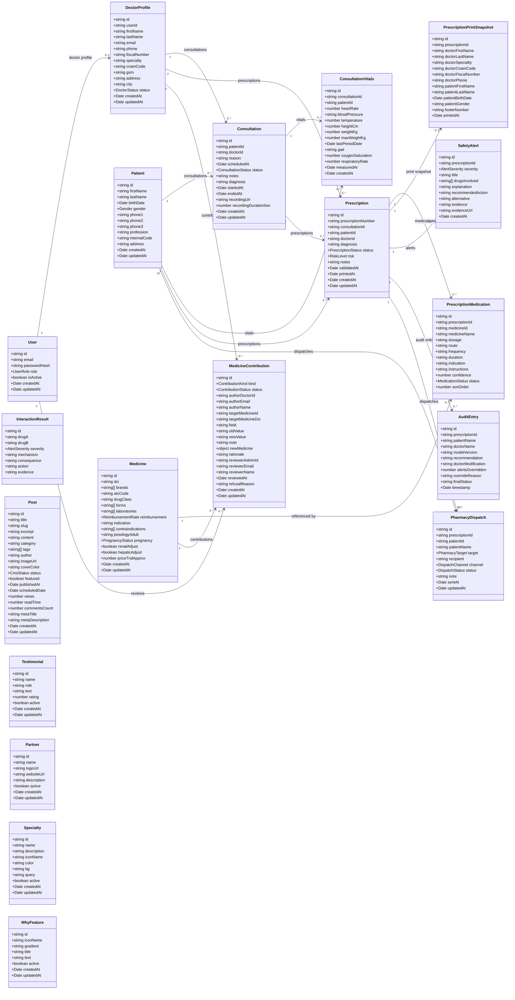

# MedCity Connect Class Diagram

```mermaid
classDiagram
  direction LR

  class User {
    +string id
    +string email
    +string passwordHash
    +UserRole role
    +boolean isActive
    +Date createdAt
    +Date updatedAt
  }

  class DoctorProfile {
    +string id
    +string userId
    +string firstName
    +string lastName
    +string email
    +string phone
    +string fiscalNumber
    +string specialty
    +string cnamCode
    +string gsm
    +string address
    +string city
    +DoctorStatus status
    +Date createdAt
    +Date updatedAt
  }

  class Patient {
    +string id
    +string firstName
    +string lastName
    +Date birthDate
    +Gender gender
    +string phone1
    +string phone2
    +string phone3
    +string profession
    +string internalCode
    +string address
    +Date createdAt
    +Date updatedAt
  }

  class Consultation {
    +string id
    +string patientId
    +string doctorId
    +string reason
    +Date scheduledAt
    +ConsultationStatus status
    +string notes
    +string diagnosis
    +Date startedAt
    +Date endedAt
    +string recordingUrl
    +number recordingDurationSec
    +Date createdAt
    +Date updatedAt
  }

  class ConsultationVitals {
    +string id
    +string consultationId
    +string patientId
    +number heartRate
    +string bloodPressure
    +number temperature
    +number heightCm
    +number weightKg
    +number maxWeightKg
    +Date lastPeriodDate
    +string gad
    +number oxygenSaturation
    +number respiratoryRate
    +Date measuredAt
    +Date createdAt
  }

  class Prescription {
    +string id
    +string prescriptionNumber
    +string consultationId
    +string patientId
    +string doctorId
    +string diagnosis
    +PrescriptionStatus status
    +RiskLevel risk
    +string notes
    +Date validatedAt
    +Date printedAt
    +Date createdAt
    +Date updatedAt
  }

  class PrescriptionMedication {
    +string id
    +string prescriptionId
    +string medicineId
    +string medicineName
    +string dosage
    +string route
    +string frequency
    +string duration
    +string indication
    +string instructions
    +number confidence
    +MedicationStatus status
    +number sortOrder
  }

  class PrescriptionPrintSnapshot {
    +string id
    +string prescriptionId
    +string doctorFirstName
    +string doctorLastName
    +string doctorSpecialty
    +string doctorCnamCode
    +string doctorFiscalNumber
    +string doctorPhone
    +string patientFirstName
    +string patientLastName
    +Date patientBirthDate
    +string patientGender
    +string footerNumber
    +Date printedAt
  }

  class Medicine {
    +string id
    +string dci
    +string[] brands
    +string atcCode
    +string drugClass
    +string[] forms
    +string[] laboratories
    +ReimbursementRate reimbursement
    +string indication
    +string[] contraindications
    +string posologyAdult
    +PregnancyStatus pregnancy
    +boolean renalAdjust
    +boolean hepaticAdjust
    +number priceTndApprox
    +Date createdAt
    +Date updatedAt
  }

  class MedicineContribution {
    +string id
    +ContributionKind kind
    +ContributionStatus status
    +string authorDoctorId
    +string authorEmail
    +string authorName
    +string targetMedicineId
    +string targetMedicineDci
    +string field
    +string oldValue
    +string newValue
    +string note
    +object newMedicine
    +string rationale
    +string reviewerAdminId
    +string reviewerEmail
    +string reviewerName
    +Date reviewedAt
    +string refusalReason
    +Date createdAt
    +Date updatedAt
  }

  class PharmacyDispatch {
    +string id
    +string prescriptionId
    +string patientId
    +string patientName
    +PharmacyTarget target
    +string recipient
    +DispatchChannel channel
    +DispatchStatus status
    +string note
    +Date sentAt
    +Date updatedAt
  }

  class SafetyAlert {
    +string id
    +string prescriptionId
    +AlertSeverity severity
    +string title
    +string[] drugsInvolved
    +string explanation
    +string recommendedAction
    +string alternative
    +string evidence
    +string evidenceUrl
    +Date createdAt
  }

  class InteractionResult {
    +string id
    +string drugA
    +string drugB
    +AlertSeverity severity
    +string mechanism
    +string consequence
    +string action
    +string evidence
  }

  class AuditEntry {
    +string id
    +string prescriptionId
    +string patientName
    +string doctorName
    +string modelVersion
    +string recommendation
    +string doctorModification
    +number alertsOverridden
    +string overrideReason
    +string finalStatus
    +Date timestamp
  }

  class Post {
    +string id
    +string title
    +string slug
    +string excerpt
    +string content
    +string category
    +string[] tags
    +string author
    +string imageUrl
    +string coverColor
    +CmsStatus status
    +boolean featured
    +Date publishedAt
    +Date scheduledDate
    +number views
    +number readTime
    +number commentsCount
    +string metaTitle
    +string metaDescription
    +Date createdAt
    +Date updatedAt
  }

  class Testimonial {
    +string id
    +string name
    +string role
    +string text
    +number rating
    +boolean active
    +Date createdAt
    +Date updatedAt
  }

  class Partner {
    +string id
    +string name
    +string logoUrl
    +string websiteUrl
    +string description
    +boolean active
    +Date createdAt
    +Date updatedAt
  }

  class Specialty {
    +string id
    +string name
    +string description
    +string iconName
    +string color
    +string bg
    +string query
    +boolean active
    +Date createdAt
    +Date updatedAt
  }

  class WhyFeature {
    +string id
    +string iconName
    +string gradient
    +string title
    +string text
    +boolean active
    +Date createdAt
    +Date updatedAt
  }

  User "1" --> "0..1" DoctorProfile : doctor profile
  DoctorProfile "1" --> "0..*" Consultation : consultations
  DoctorProfile "1" --> "0..*" Prescription : prescriptions
  DoctorProfile "1" --> "0..*" MedicineContribution : contributions

  Patient "1" --> "0..*" Consultation : consultations
  Patient "1" --> "0..*" ConsultationVitals : vitals
  Patient "1" --> "0..*" Prescription : prescriptions
  Patient "1" --> "0..*" PharmacyDispatch : dispatches

  Consultation "1" --> "0..*" ConsultationVitals : vitals
  Consultation "1" --> "0..*" Prescription : prescriptions

  Prescription "1" --> "0..*" PrescriptionMedication : medications
  Prescription "1" --> "0..1" PrescriptionPrintSnapshot : print snapshot
  Prescription "1" --> "0..*" SafetyAlert : alerts
  Prescription "1" --> "0..*" AuditEntry : audit entries
  Prescription "1" --> "0..*" PharmacyDispatch : dispatches

  Medicine "1" --> "0..*" PrescriptionMedication : referenced by
  Medicine "1" --> "0..*" MedicineContribution : contributions
  User "1" --> "0..*" MedicineContribution : reviews
```
