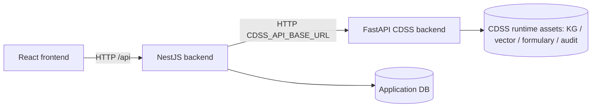
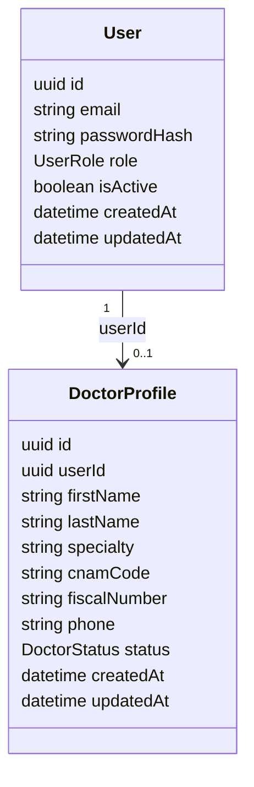
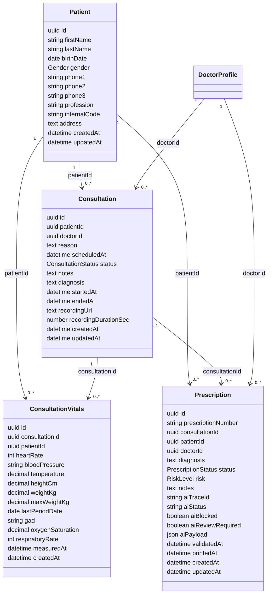
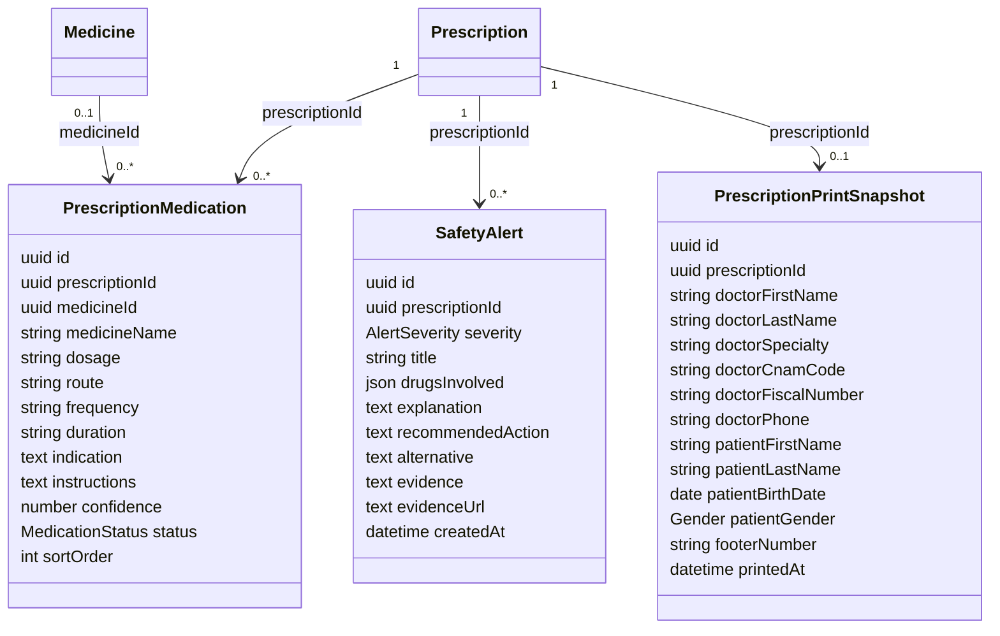
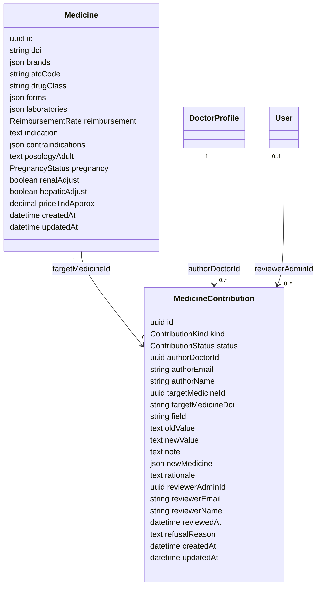
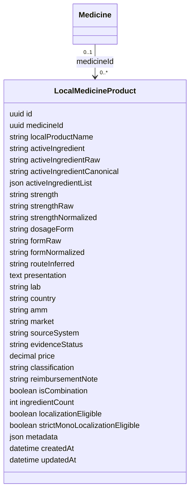
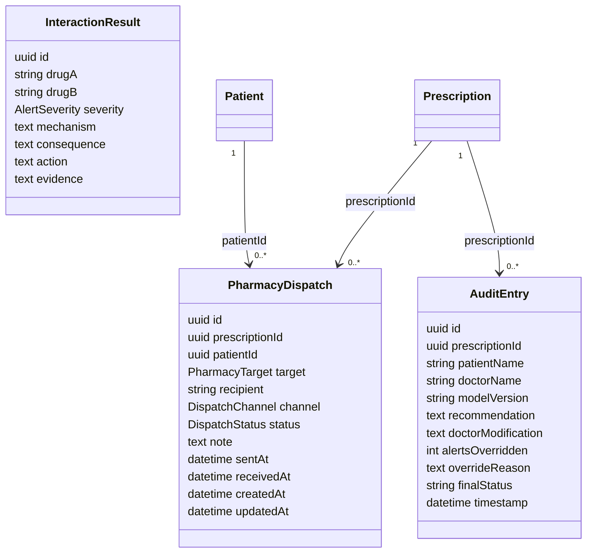
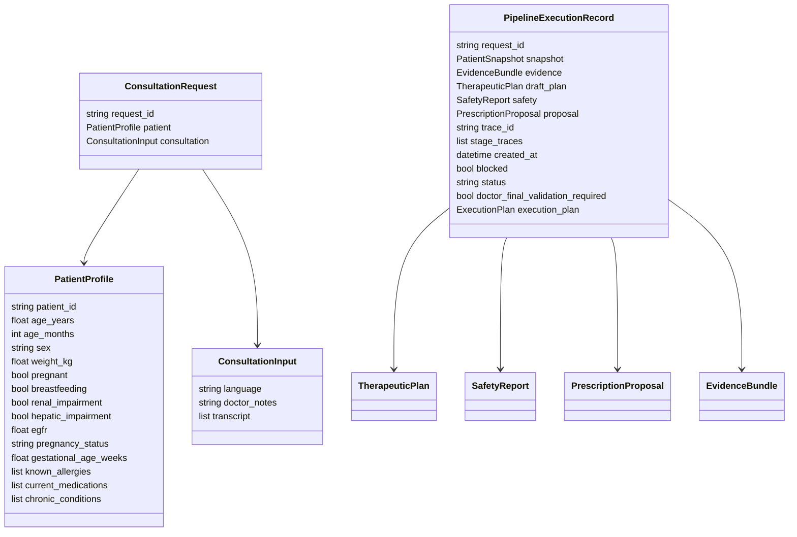
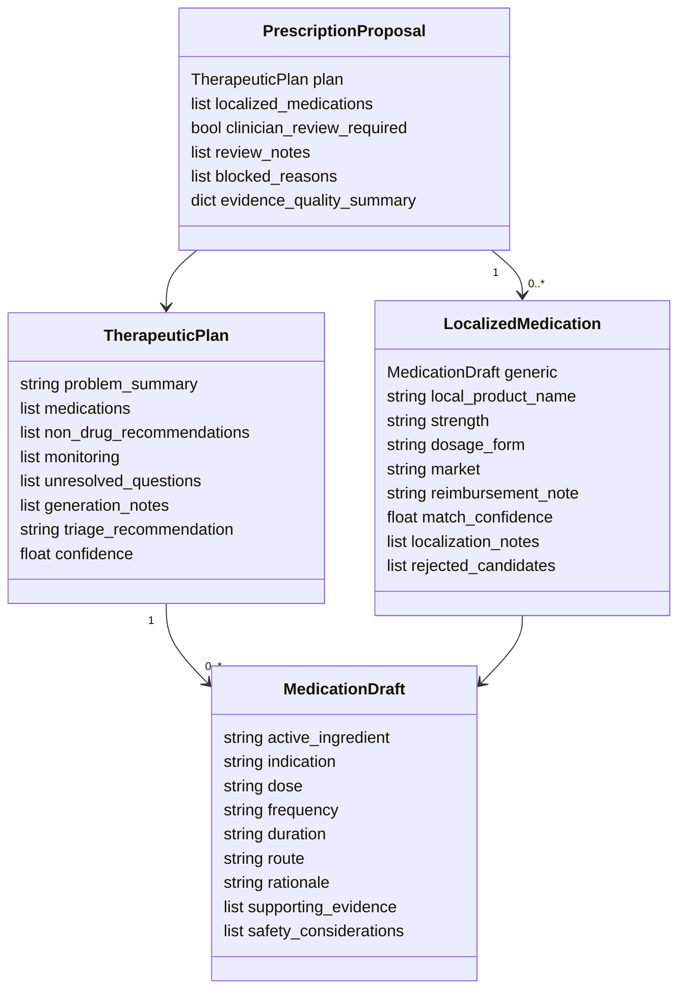
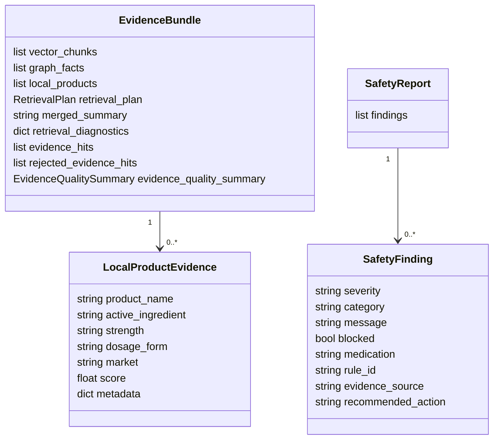

# Backend Architecture And Contracts

This document describes the two backend layers used by the MedCity prescription system:

- **NestJS backend**: application backend, authentication, users, doctors, patients, persistence, audit, prescriptions, pharmacy dispatch, medicine catalog, and CDSS adapter.
- **FastAPI CDSS backend**: IA/clinical decision support runtime for clinical analysis, draft generation, evidence retrieval, safety validation, localization, audit traces, and feedback.

The intended flow is:



The frontend should call **NestJS only**. FastAPI is an internal clinical runtime consumed by NestJS.

## Service Boundaries

| Layer | Main responsibility | Should own |
|---|---|---|
| React frontend | Doctor/admin user experience | Screens, forms, review workflow |
| NestJS backend | Product/application backend | Auth, roles, relational data, saved prescriptions, audit, pharmacy dispatch, CDSS adapter |
| FastAPI CDSS | Clinical IA runtime | Clinical understanding, draft generation, evidence, safety, localization, trace audit |

## NestJS API Endpoints

Global prefix: `/api`

### Auth

| Method | Endpoint | Purpose |
|---|---|---|
| `POST` | `/api/auth/login` | Login, returns access/refresh tokens |
| `POST` | `/api/auth/logout` | Logout placeholder |
| `GET` | `/api/auth/me` | Current authenticated user |
| `POST` | `/api/auth/refresh` | Refresh token |

### CDSS Adapter

These endpoints are NestJS-facing wrappers around FastAPI CDSS.

| Method | Endpoint | Calls FastAPI | Purpose |
|---|---|---|---|
| `POST` | `/api/cdss/prescriptions/draft` | `/v1/prescriptions/draft` | Generate IA draft; optionally save mapped prescription |
| `POST` | `/api/cdss/prescriptions/analyze` | `/v1/prescriptions/analyze` | Clinical analysis without full generation |
| `POST` | `/api/cdss/prescriptions/validate-plan` | `/v1/prescriptions/validate` | Validate an existing therapeutic plan |
| `GET` | `/api/cdss/formulary/search` | `/v1/prescriptions/formulary/search` | Search CDSS local formulary |
| `GET` | `/api/cdss/kg/search` | `/v1/prescriptions/kg/search` | Search CDSS KG facts |
| `GET` | `/api/cdss/prescriptions/audit/:traceId` | `/v1/prescriptions/audit/{trace_id}` | Fetch CDSS trace |

### Patients

| Method | Endpoint | Purpose |
|---|---|---|
| `GET` | `/api/patients` | List/search patients |
| `GET` | `/api/patients/:id` | Get patient |
| `POST` | `/api/patients` | Create patient |
| `PATCH` | `/api/patients/:id` | Update patient |
| `DELETE` | `/api/patients/:id` | Delete patient |
| `GET` | `/api/patients/:id/consultations` | Patient consultations |
| `GET` | `/api/patients/:id/prescriptions` | Patient prescriptions |
| `GET` | `/api/patients/:id/vitals` | Patient vitals |

### Consultations

| Method | Endpoint | Purpose |
|---|---|---|
| `GET` | `/api/consultations` | List consultations |
| `GET` | `/api/consultations/:id` | Get consultation |
| `POST` | `/api/consultations` | Create consultation |
| `PATCH` | `/api/consultations/:id` | Update consultation |
| `DELETE` | `/api/consultations/:id` | Delete consultation |
| `PATCH` | `/api/consultations/:id/start` | Mark in progress |
| `PATCH` | `/api/consultations/:id/complete` | Mark completed |
| `PATCH` | `/api/consultations/:id/cancel` | Mark cancelled |
| `GET` | `/api/consultations/:id/vitals` | Get vitals |
| `POST` | `/api/consultations/:id/vitals` | Add vitals |

### Prescriptions

| Method | Endpoint | Purpose |
|---|---|---|
| `GET` | `/api/prescriptions` | List prescriptions |
| `GET` | `/api/prescriptions/:id` | Get prescription |
| `POST` | `/api/prescriptions` | Create prescription manually |
| `PATCH` | `/api/prescriptions/:id` | Update prescription |
| `DELETE` | `/api/prescriptions/:id` | Delete prescription |
| `POST` | `/api/prescriptions/:id/medications` | Add medication line |
| `PATCH` | `/api/prescriptions/:id/medications/:medicationId` | Update medication line |
| `DELETE` | `/api/prescriptions/:id/medications/:medicationId` | Delete medication line |
| `POST` | `/api/prescriptions/:id/validate` | Doctor validates prescription |
| `POST` | `/api/prescriptions/:id/reject` | Doctor rejects prescription |
| `POST` | `/api/prescriptions/:id/print-snapshot` | Freeze ordonnance print data |
| `GET` | `/api/prescriptions/:id/ordonnance` | Printable ordonnance payload |
| `POST` | `/api/prescriptions/:id/send-to-pharmacy` | Dispatch to pharmacy |
| `POST` | `/api/prescriptions/:id/send-to-patient` | Dispatch to patient |
| `POST` | `/api/prescriptions/:id/safety-check` | Local NestJS safety check |
| `GET` | `/api/prescriptions/:id/safety-alerts` | Get safety alerts |

### Medicines And Interactions

| Method | Endpoint | Purpose |
|---|---|---|
| `GET` | `/api/medicines` | List medicine summary catalog |
| `GET` | `/api/medicines/search?q=` | Search medicine catalog |
| `GET` | `/api/medicines/classes` | List drug classes |
| `GET` | `/api/medicines/:id` | Get medicine |
| `POST` | `/api/medicines` | Admin create medicine |
| `PATCH` | `/api/medicines/:id` | Admin update medicine |
| `DELETE` | `/api/medicines/:id` | Admin delete medicine |
| `POST` | `/api/interactions/check` | Check stored interaction pairs |
| `GET` | `/api/interactions` | List interaction records |

### Other Application APIs

| Controller | Endpoints |
|---|---|
| Doctors | `/api/doctors`, `/api/doctors/me/profile`, `/api/doctors/:id/status` |
| Pharmacy | `/api/pharmacy/dispatches`, `/api/pharmacy/dispatches/:id/status` |
| Medicine contributions | `/api/medicine-contributions`, `/api/medicine-contributions/:id/validate`, `/api/medicine-contributions/:id/refuse` |
| Audit | `/api/audit`, `/api/audit/prescriptions/:prescriptionId`, `/api/audit/:id` |
| CMS | `/api/cms/posts`, `/api/cms/testimonials`, `/api/cms/partners`, `/api/cms/specialties`, `/api/cms/why-features` |
| Public CMS | `/api/public/home`, `/api/public/posts`, `/api/public/testimonials`, `/api/public/partners`, `/api/public/specialties` |
| Translation | `/api/translations/languages`, `/api/translations/translate`, `/api/translations/translate-fields` |
| Health | `/api/health` |

## FastAPI CDSS Endpoints

FastAPI prefix: `/v1` for most runtime routes. `/health` is unprefixed.

| Method | Endpoint | Purpose |
|---|---|---|
| `GET` | `/health` | Process liveness |
| `GET` | `/v1/system/status` | Runtime status |
| `GET` | `/v1/system/model-cache` | Model/cache status |
| `GET` | `/v1/system/readiness` | Clinical readiness/resource checks |
| `POST` | `/v1/prescriptions/draft` | Full CDSS pipeline: analysis, retrieval, generation, safety, localization, audit |
| `POST` | `/v1/prescriptions/analyze` | Clinical analysis and pre-planning only |
| `POST` | `/v1/prescriptions/evidence` | Analysis plus retrieval only |
| `POST` | `/v1/prescriptions/validate` | Validate an existing therapeutic plan |
| `POST` | `/v1/prescriptions/localize` | Map generic plan to local Tunisian product candidates |
| `GET` | `/v1/prescriptions/formulary/search` | Search local formulary product candidates |
| `GET` | `/v1/prescriptions/tn-med/search` | Search TN Med enrichment DB |
| `GET` | `/v1/prescriptions/kg/search` | Search KG facts |
| `GET` | `/v1/prescriptions/audit/{trace_id}` | Fetch audited pipeline execution |
| `GET` | `/v1/prescriptions/audit/{trace_id}/review-packet` | Fetch clinician review packet |
| `POST` | `/v1/prescriptions/{trace_id}/feedback` | Store clinician feedback |
| `POST` | `/v1/prescriptions/{trace_id}/approve` | Legacy approve wrapper |
| `POST` | `/v1/prescriptions/{trace_id}/reject` | Legacy reject wrapper |
| `POST` | `/v1/prescriptions/{trace_id}/revise` | Legacy revise wrapper |
| `GET` | `/v1/prescriptions/{trace_id}` | Fetch audit record by trace |
| `GET` | `/v1/prescriptions/patient/{patient_id}/history` | Debug patient history, disabled by default |
| `GET` | `/v1/audit/traces/{trace_id}` | Fetch trace through audit router |
| `POST` | `/v1/feedback/clinician` | Feedback endpoint |
| `GET` | `/v1/monitoring/*` | Overview, pipeline, performance, model, safety, feedback, retrieval, localization, clinical quality |

## NestJS Tables And Fields

### Core Identity



### Patient, Consultation, Prescription



### Prescription Details



### Medicine Catalog

Current NestJS `medicines` is a **summary/catalog table**, not a one-to-one match for the FastAPI CDSS local product/formulary model.



Recommended future table for alignment with FastAPI:



This is the missing table if NestJS must persist CDSS-localized product candidates.

### Pharmacy, Audit, Interactions



## FastAPI CDSS Contract Classes

FastAPI uses Pydantic models, not TypeORM tables, for runtime contracts.







## NestJS To FastAPI Mapping

### Draft Prescription

NestJS request to FastAPI:

| NestJS app input | FastAPI field |
|---|---|
| `patientId` | `patient.patient_id` |
| `patientContext.ageYears` | `patient.age_years` |
| `patientContext.weightKg` | `patient.weight_kg` |
| `patientContext.allergies` | `patient.known_allergies` |
| `patientContext.currentMedications` | `patient.current_medications` |
| `patientContext.chronicConditions` | `patient.chronic_conditions` |
| `patientContext.egfr` | `patient.egfr` |
| `patientContext.renalImpairment` | `patient.renal_impairment` |
| `patientContext.hepaticImpairment` | `patient.hepatic_impairment` |
| `diagnosis + notes` | `consultation.doctor_notes` |
| `language` | `consultation.language` |

FastAPI draft response to NestJS persistence:

| FastAPI output | NestJS field/table |
|---|---|
| `trace_id` | `prescriptions.aiTraceId` |
| `status` | `prescriptions.aiStatus` |
| `blocked` | `prescriptions.aiBlocked` |
| `doctor_final_validation_required` / `proposal.clinician_review_required` | `prescriptions.aiReviewRequired` |
| full response | `prescriptions.aiPayload` |
| `draft_plan.problem_summary` | `prescriptions.diagnosis` fallback |
| `draft_plan.medications[].active_ingredient` | `prescription_medications.medicineName` |
| `draft_plan.medications[].dose` | `prescription_medications.dosage` |
| `draft_plan.medications[].frequency` | `prescription_medications.frequency` |
| `draft_plan.medications[].duration` | `prescription_medications.duration` |
| `draft_plan.medications[].route` | `prescription_medications.route` |
| `draft_plan.medications[].indication` | `prescription_medications.indication` |
| `draft_plan.medications[].rationale + safety_considerations` | `prescription_medications.instructions` |
| `safety.findings[]` | `safety_alerts[]` |

### Medicine/Formulary Mapping Gap

Current NestJS `medicines` table:

```text
One DCI summary -> many brands/forms/labs stored as arrays.
```

FastAPI CDSS local formulary:

```text
One local product candidate -> one active ingredient, strength, form, AMM, lab, market, metadata.
```

Therefore, **NestJS medicines and FastAPI LocalProductEvidence are not equivalent**.

Recommended mapping if `LocalMedicineProduct` is added:

| FastAPI `LocalProductEvidence` | Recommended NestJS `LocalMedicineProduct` |
|---|---|
| `product_name` | `localProductName` |
| `active_ingredient` | `activeIngredient` |
| `strength` | `strength` |
| `dosage_form` | `dosageForm` |
| `market` | `market` |
| `metadata.amm` | `amm` |
| `metadata.lab` | `lab` |
| `metadata.price` | `price` |
| `metadata.classification` | `classification` |
| `metadata.source_system` | `sourceSystem` |
| `metadata.evidence_status` | `evidenceStatus` |
| `metadata.is_combination` | `isCombination` |
| `metadata.ingredient_count` | `ingredientCount` |
| `metadata.localization_eligible` | `localizationEligible` |
| full `metadata` | `metadata` |

## Current Alignment Status

| Area | Status | Notes |
|---|---|---|
| NestJS consumes FastAPI CDSS | Implemented | `CdssService` calls FastAPI using `CDSS_API_BASE_URL` |
| Draft prescription mapping | Implemented | FastAPI draft maps to NestJS prescription and medication rows |
| Safety finding mapping | Implemented | FastAPI safety maps to NestJS `safety_alerts` |
| Trace/audit reference | Implemented | FastAPI `trace_id` stored on NestJS prescription |
| Medicine summary table | Implemented but not CDSS-equivalent | Current table is UI/admin catalog |
| Product-level local formulary table | Missing | Needed for full alignment with FastAPI `LocalProductEvidence` |
| Full CDSS asset synchronization into NestJS DB | Missing | NestJS currently queries FastAPI instead of storing its formulary |

## Recommended Next Implementation

1. Add `local_medicine_products` table in NestJS.
2. Add DTOs and controller endpoints:
   - `GET /api/local-medicine-products`
   - `GET /api/local-medicine-products/search`
   - `POST /api/local-medicine-products/sync-from-cdss`
3. Extend `CdssService.searchFormulary()` to optionally upsert returned products.
4. Link `prescription_medications` to `localMedicineProductId` when a localized product is selected.
5. Keep `medicines` as the human/admin summary catalog.

