# Backend Architecture And Contracts

This document describes the two backend layers used by the MedCity prescription system:

- **NestJS backend**: application backend, authentication, users, doctors, patients, persistence, audit, prescriptions, pharmacy dispatch, medicine catalog, and CDSS adapter.
- **FastAPI CDSS backend**: IA/clinical decision support runtime for clinical analysis, draft generation, evidence retrieval, safety validation, localization, audit traces, and feedback.

The intended flow is:

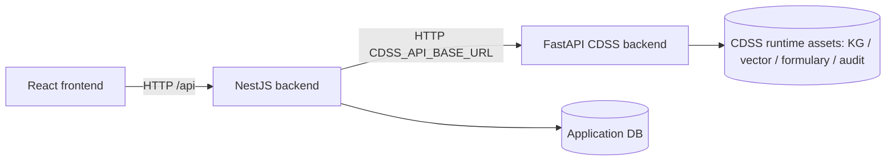

The frontend should call **NestJS only**. FastAPI is an internal clinical runtime consumed by NestJS.

## Service Boundaries

| Layer | Main responsibility | Should own |
|---|---|---|
| React frontend | Doctor/admin user experience | Screens, forms, review workflow |
| NestJS backend | Product/application backend | Auth, roles, relational data, saved prescriptions, audit, pharmacy dispatch, CDSS adapter |
| FastAPI CDSS | Clinical IA runtime | Clinical understanding, draft generation, evidence, safety, localization, trace audit |

## NestJS API Endpoints

Global prefix: `/api`

### Automated API CRUD Tests

The NestJS backend includes an isolated API CRUD test script:

```bash
npm --prefix backend_template run test:api-crud
npm --prefix backend_template run test:clinical-crud
```

These scripts boot the NestJS app against temporary SQLite databases and validate the main endpoint contracts without opening the frontend.

`test:api-crud` covers:

- Auth guard/login flow.
- Patient create/list/read/update/delete.
- Consultation create/update/status transitions/vitals/delete.
- Admin CMS CRUD for posts, testimonials, partners, specialties, and why-features.
- Public contact/newsletter submission plus admin retrieval/status update.

`test:clinical-crud` covers:

- Doctor admin CRUD/status and doctor self-profile update.
- Medicine admin CRUD, list/filter/search/classes.
- Prescription create/update medication lines/safety check/validate/reject/print snapshot/ordonnance/delete.
- Pharmacy dispatch creation from prescription and manual dispatch update/status/delete.
- Medicine contributions create/list/validate/refuse/delete, including new-medicine validation.
- Interactions list/search/check.
- CDSS adapter routes against a fake local CDSS server.
- Translation routes against a fake local LibreTranslate server.
- Audio upload target validation smoke tests.
- Prometheus metrics endpoint.

The CI backend job runs both scripts after the frontend/backend contract test.

External integrations have a separate opt-in test script:

```bash
# Real Resend email + real Supabase/Kaggle smoke
$env:RUN_EXTERNAL_INTEGRATION_TESTS="true"
$env:EXTERNAL_TEST_TARGET="all" # all | resend | audio
$env:EXTERNAL_AUDIO_MODE="upload-status" # upload-status | start-processing | full
$env:EXTERNAL_TEST_EMAIL="triguiislem1@gmail.com"
npm --prefix backend_template run test:external-integrations
```

External modes:

- `resend`: sends a real email through Resend and asserts Resend returns an email id.
- `audio` with `upload-status`: uploads a generated WAV file to real Supabase Storage, then checks real Kaggle kernel status.
- `audio` with `start-processing`: also downloads the Supabase object, versions the Kaggle dataset, and pushes the Kaggle kernel.
- `audio` with `full`: also waits for Kaggle completion and fetches `result.json`.

These tests are intentionally not part of push/PR CI. They require real secrets and can be run from the manual `External Integrations` GitHub Actions workflow.

### Auth

| Method | Endpoint | Purpose |
|---|---|---|
| `POST` | `/api/auth/login` | Login, returns access/refresh tokens |
| `POST` | `/api/auth/logout` | Logout placeholder |
| `GET` | `/api/auth/me` | Current authenticated user |
| `POST` | `/api/auth/refresh` | Refresh token |

### CDSS Adapter

These endpoints are NestJS-facing wrappers around FastAPI CDSS. The integration
contract is based on
`cdss_nestjs_fastapi_complete_adapter_v2_with_kaggle_docs.zip`; older local CDSS
professional folders are not used as the source of truth for this adapter.

Execution modes:

- `CDSS_EXECUTION_MODE=direct`: NestJS calls a reachable FastAPI runtime through `CDSS_API_BASE_URL`.
- `CDSS_EXECUTION_MODE=kaggle`: NestJS injects a `JOB_PAYLOAD` into the configured Kaggle notebook worker, submits the kernel, then downloads `result.json` after completion.

| Method | Endpoint | Calls FastAPI | Purpose |
|---|---|---|---|
| `GET` | `/api/cdss/endpoints/catalog` | internal catalog | List NestJS-to-FastAPI adapter routes |
| `GET` | `/api/cdss/health` | `/health` | FastAPI process liveness |
| `GET` | `/api/cdss/system/status` | `/v1/system/status` | Runtime status |
| `GET` | `/api/cdss/system/model-cache` | `/v1/system/model-cache` | Model/cache diagnostics |
| `POST` | `/api/cdss/system/model-cache/warmup` | `/v1/system/model-cache/warmup` | Warm model cache |
| `POST` | `/api/cdss/system/qwen/warmup` | `/v1/system/qwen/warmup` | Warm Qwen runtime |
| `GET` | `/api/cdss/system/readiness` | `/v1/system/readiness` | Clinical readiness/resource checks |
| `POST` | `/api/cdss/prescriptions/draft` | `/v1/prescriptions/draft` | Generate IA draft; optionally save mapped prescription |
| `POST` | `/api/cdss/prescriptions/analyze` | `/v1/prescriptions/analyze` | Clinical analysis without full generation |
| `POST` | `/api/cdss/prescriptions/evidence` | `/v1/prescriptions/evidence` | Clinical analysis plus evidence retrieval |
| `POST` | `/api/cdss/prescriptions/validate-plan` | `/v1/prescriptions/validate` | Validate an existing therapeutic plan |
| `POST` | `/api/cdss/prescriptions/localize` | `/v1/prescriptions/localize` | Map generic plan to local Tunisian product candidates |
| `GET` | `/api/cdss/formulary/search` | `/v1/prescriptions/formulary/search` | Search CDSS local formulary |
| `GET` | `/api/cdss/tn-med/search` | `/v1/prescriptions/tn-med/search` | Search TN Med enrichment DB |
| `GET` | `/api/cdss/kg/search` | `/v1/prescriptions/kg/search` | Search CDSS KG facts |
| `GET` | `/api/cdss/prescriptions/audit/:traceId` | `/v1/prescriptions/audit/{trace_id}` | Fetch CDSS trace |
| `GET` | `/api/cdss/prescriptions/audit/:traceId/review-packet` | `/v1/prescriptions/audit/{trace_id}/review-packet` | Fetch clinician review packet |
| `GET` | `/api/cdss/prescriptions/:traceId` | `/v1/prescriptions/{trace_id}` | Fetch audit record by trace |
| `GET` | `/api/cdss/prescriptions/patient/:patientId/history` | `/v1/prescriptions/patient/{patient_id}/history` | Debug patient history |
| `GET` | `/api/cdss/audit/traces/:traceId` | `/v1/audit/traces/{trace_id}` | Fetch trace through audit router |
| `POST` | `/api/cdss/prescriptions/:traceId/feedback` | `/v1/prescriptions/{trace_id}/feedback` | Store structured clinician feedback |
| `POST` | `/api/cdss/prescriptions/:traceId/approve` | `/v1/prescriptions/{trace_id}/approve` | Legacy approve wrapper |
| `POST` | `/api/cdss/prescriptions/:traceId/reject` | `/v1/prescriptions/{trace_id}/reject` | Legacy reject wrapper |
| `POST` | `/api/cdss/prescriptions/:traceId/revise` | `/v1/prescriptions/{trace_id}/revise` | Legacy revise wrapper |
| `POST` | `/api/cdss/feedback/clinician` | `/v1/feedback/clinician` | Lightweight clinician feedback |
| `GET` | `/api/cdss/monitoring/*` | `/v1/monitoring/*` | Monitoring sections in direct mode |
| `GET` | `/api/cdss/jobs/:owner/:slug/status` | Kaggle CLI | Check Kaggle worker status |
| `POST` | `/api/cdss/jobs/:owner/:slug/fetch-result` | Kaggle CLI | Download worker outputs and parse result JSON |

### Patients

| Method | Endpoint | Purpose |
|---|---|---|
| `GET` | `/api/patients` | List/search patients |
| `GET` | `/api/patients/:id` | Get patient |
| `POST` | `/api/patients` | Create patient |
| `PATCH` | `/api/patients/:id` | Update patient |
| `DELETE` | `/api/patients/:id` | Delete patient |
| `GET` | `/api/patients/:id/consultations` | Patient consultations |
| `GET` | `/api/patients/:id/prescriptions` | Patient prescriptions |
| `GET` | `/api/patients/:id/vitals` | Patient vitals |

### Consultations

| Method | Endpoint | Purpose |
|---|---|---|
| `GET` | `/api/consultations` | List consultations |
| `GET` | `/api/consultations/:id` | Get consultation |
| `POST` | `/api/consultations` | Create consultation |
| `PATCH` | `/api/consultations/:id` | Update consultation |
| `DELETE` | `/api/consultations/:id` | Delete consultation |
| `PATCH` | `/api/consultations/:id/start` | Mark in progress |
| `PATCH` | `/api/consultations/:id/complete` | Mark completed |
| `PATCH` | `/api/consultations/:id/cancel` | Mark cancelled |
| `GET` | `/api/consultations/:id/vitals` | Get vitals |
| `POST` | `/api/consultations/:id/vitals` | Add vitals |

### Consultation Audio Processing

These endpoints are consumed by the doctor consultation recording screen. NestJS stays the only public backend: it uploads the recording to Supabase Storage, prepares the Kaggle dataset/kernel, polls Kaggle, then stores the transcript/result on the consultation.

Storage can run in either mode:

- Supabase Storage REST API with `SUPABASE_SERVICE_ROLE_KEY`.
- Supabase Storage S3 compatibility with `SUPABASE_S3_ENDPOINT`, `SUPABASE_S3_ACCESS_KEY_ID`, and `SUPABASE_S3_SECRET_ACCESS_KEY` as used by the audio Kaggle demo.

| Method | Endpoint | Purpose |
|---|---|---|
| `POST` | `/api/audio/create-upload-url` | Return the backend upload target metadata for a consultation recording |
| `POST` | `/api/audio/upload?consultationId=&filename=` | Upload the raw audio body to Supabase Storage |
| `POST` | `/api/audio/start-processing` | Download audio from Supabase, version the Kaggle dataset, and push the processor kernel |
| `GET` | `/api/kaggle/status` | Check the configured Kaggle kernel status |
| `POST` | `/api/kaggle/fetch-output` | Download Kaggle output and persist `result.json` / transcript |

### Prescriptions

| Method | Endpoint | Purpose |
|---|---|---|
| `GET` | `/api/prescriptions` | List prescriptions |
| `GET` | `/api/prescriptions/:id` | Get prescription |
| `POST` | `/api/prescriptions` | Create prescription manually |
| `PATCH` | `/api/prescriptions/:id` | Update prescription |
| `DELETE` | `/api/prescriptions/:id` | Delete prescription |
| `POST` | `/api/prescriptions/:id/medications` | Add medication line |
| `PATCH` | `/api/prescriptions/:id/medications/:medicationId` | Update medication line |
| `DELETE` | `/api/prescriptions/:id/medications/:medicationId` | Delete medication line |
| `POST` | `/api/prescriptions/:id/validate` | Doctor validates prescription |
| `POST` | `/api/prescriptions/:id/reject` | Doctor rejects prescription |
| `POST` | `/api/prescriptions/:id/print-snapshot` | Freeze ordonnance print data |
| `GET` | `/api/prescriptions/:id/ordonnance` | Printable ordonnance payload |
| `POST` | `/api/prescriptions/:id/send-to-pharmacy` | Dispatch to pharmacy |
| `POST` | `/api/prescriptions/:id/send-to-patient` | Dispatch to patient |
| `POST` | `/api/prescriptions/:id/safety-check` | Local NestJS safety check |
| `GET` | `/api/prescriptions/:id/safety-alerts` | Get safety alerts |

### Medicines And Interactions

| Method | Endpoint | Purpose |
|---|---|---|
| `GET` | `/api/medicines` | List medicine summary catalog |
| `GET` | `/api/medicines/search?q=` | Search medicine catalog |
| `GET` | `/api/medicines/classes` | List drug classes |
| `GET` | `/api/medicines/:id` | Get medicine |
| `POST` | `/api/medicines` | Admin create medicine |
| `PATCH` | `/api/medicines/:id` | Admin update medicine |
| `DELETE` | `/api/medicines/:id` | Admin delete medicine |
| `POST` | `/api/interactions/check` | Check stored interaction pairs |
| `GET` | `/api/interactions` | List interaction records |

### Other Application APIs

| Controller | Endpoints |
|---|---|
| Doctors | `/api/doctors`, `/api/doctors/me/profile`, `/api/doctors/:id/status` |
| Pharmacy | `/api/pharmacy/dispatches`, `/api/pharmacy/dispatches/:id/status` |
| Medicine contributions | `/api/medicine-contributions`, `/api/medicine-contributions/:id/validate`, `/api/medicine-contributions/:id/refuse` |
| Audit | `/api/audit`, `/api/audit/prescriptions/:prescriptionId`, `/api/audit/:id` |
| CMS | `/api/cms/posts`, `/api/cms/testimonials`, `/api/cms/partners`, `/api/cms/specialties`, `/api/cms/why-features`, `/api/cms/contact-messages`, `/api/cms/newsletter-subscriptions` |
| Public CMS | `/api/public/home`, `/api/public/posts`, `/api/public/testimonials`, `/api/public/partners`, `/api/public/specialties`, `/api/public/contact-messages`, `/api/public/newsletter-subscriptions` |
| Translation | `/api/translations/languages`, `/api/translations/translate`, `/api/translations/translate-fields` |
| Health | `/api/health` |

### Monitoring

The Docker runtime includes a Prometheus/Grafana stack for operational monitoring.

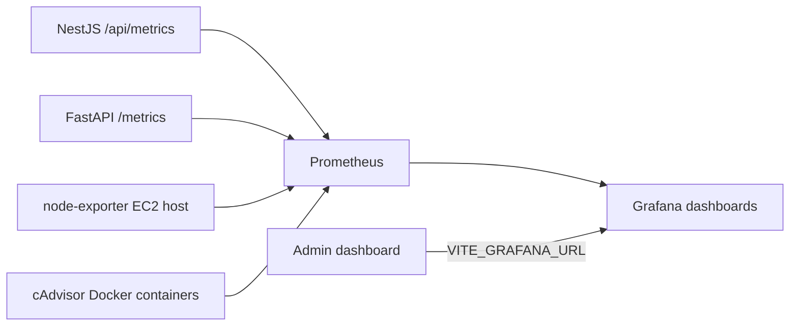

Grafana dashboards are provisioned from `monitoring/grafana/dashboards`:

- `MedCity Overview`: NestJS API, FastAPI CDSS, request rate, latency, memory, and service health.
- `MedCity EC2 Host`: EC2 CPU, RAM, disk, network, and Docker container resource usage when `COMPOSE_PROFILES=host-monitoring` is enabled.

The admin dashboard exposes an external `Monitoring Grafana` action. Configure it with:

```env
GRAFANA_PUBLIC_URL=https://example.tn/grafana/
VITE_GRAFANA_URL=https://example.tn/grafana/d/medcity-overview/medcity-overview?orgId=1&refresh=30s
```

Keep Prometheus private. In Docker production, the frontend Nginx container proxies Grafana at `/grafana/`, so administrators can open monitoring from the admin dashboard through the same public application origin without exposing Grafana port `3001`.

### Email Delivery

Contact, doctor-to-admin messages, newsletter submissions, and email-channel prescription dispatches are persisted first, then sent through Resend as non-blocking notifications. If Resend is not configured or fails, the saved database/dispatch record remains available through the admin endpoints.

Required environment variables:

| Variable | Purpose |
|---|---|
| `EMAIL_ENABLED` | Enables/disables outbound email |
| `RESEND_API_KEY` | Resend API key |
| `RESEND_FROM` | Sender identity, for example `MedCity Connect <onboarding@resend.dev>` for tests or a verified domain sender in production |
| `CONTACT_NOTIFICATION_TO` | Admin/contact mailbox for public and doctor contact messages |
| `NEWSLETTER_NOTIFICATION_TO` | Admin/contact mailbox notified on new newsletter subscriptions |
| `NEWSLETTER_CONFIRMATION_ENABLED` | Sends confirmation email to the subscriber when `true` |

Prescription dispatch emails use the same `EMAIL_ENABLED`, `RESEND_API_KEY`,
`RESEND_FROM`, and `RESEND_TIMEOUT_MS` settings. SMS, fax, portal, and pharmacy
portal dispatch channels are currently stored as dispatch records only.

## FastAPI CDSS Endpoints

FastAPI prefix: `/v1` for most runtime routes. `/health` is unprefixed.

| Method | Endpoint | Purpose |
|---|---|---|
| `GET` | `/health` | Process liveness |
| `GET` | `/v1/system/status` | Runtime status |
| `GET` | `/v1/system/model-cache` | Model/cache status |
| `POST` | `/v1/system/model-cache/warmup` | Model/cache warmup |
| `POST` | `/v1/system/qwen/warmup` | Qwen warmup |
| `GET` | `/v1/system/readiness` | Clinical readiness/resource checks |
| `POST` | `/v1/prescriptions/draft` | Full CDSS pipeline: analysis, retrieval, generation, safety, localization, audit |
| `POST` | `/v1/prescriptions/analyze` | Clinical analysis and pre-planning only |
| `POST` | `/v1/prescriptions/evidence` | Analysis plus retrieval only |
| `POST` | `/v1/prescriptions/validate` | Validate an existing therapeutic plan |
| `POST` | `/v1/prescriptions/localize` | Map generic plan to local Tunisian product candidates |
| `GET` | `/v1/prescriptions/formulary/search` | Search local formulary product candidates |
| `GET` | `/v1/prescriptions/tn-med/search` | Search TN Med enrichment DB |
| `GET` | `/v1/prescriptions/kg/search` | Search KG facts |
| `GET` | `/v1/prescriptions/audit/{trace_id}` | Fetch audited pipeline execution |
| `GET` | `/v1/prescriptions/audit/{trace_id}/review-packet` | Fetch clinician review packet |
| `POST` | `/v1/prescriptions/{trace_id}/feedback` | Store clinician feedback |
| `POST` | `/v1/prescriptions/{trace_id}/approve` | Legacy approve wrapper |
| `POST` | `/v1/prescriptions/{trace_id}/reject` | Legacy reject wrapper |
| `POST` | `/v1/prescriptions/{trace_id}/revise` | Legacy revise wrapper |
| `GET` | `/v1/prescriptions/{trace_id}` | Fetch audit record by trace |
| `GET` | `/v1/prescriptions/patient/{patient_id}/history` | Debug patient history, disabled by default |
| `GET` | `/v1/audit/traces/{trace_id}` | Fetch trace through audit router |
| `POST` | `/v1/feedback/clinician` | Feedback endpoint |
| `GET` | `/v1/monitoring/*` | Overview, pipeline, performance, model, safety, feedback, retrieval, localization, clinical quality |

## NestJS Tables And Fields

### Core Identity

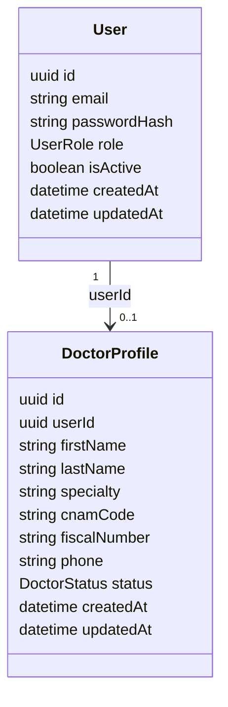

### Patient, Consultation, Prescription

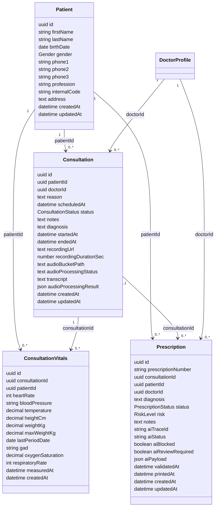

### Prescription Details

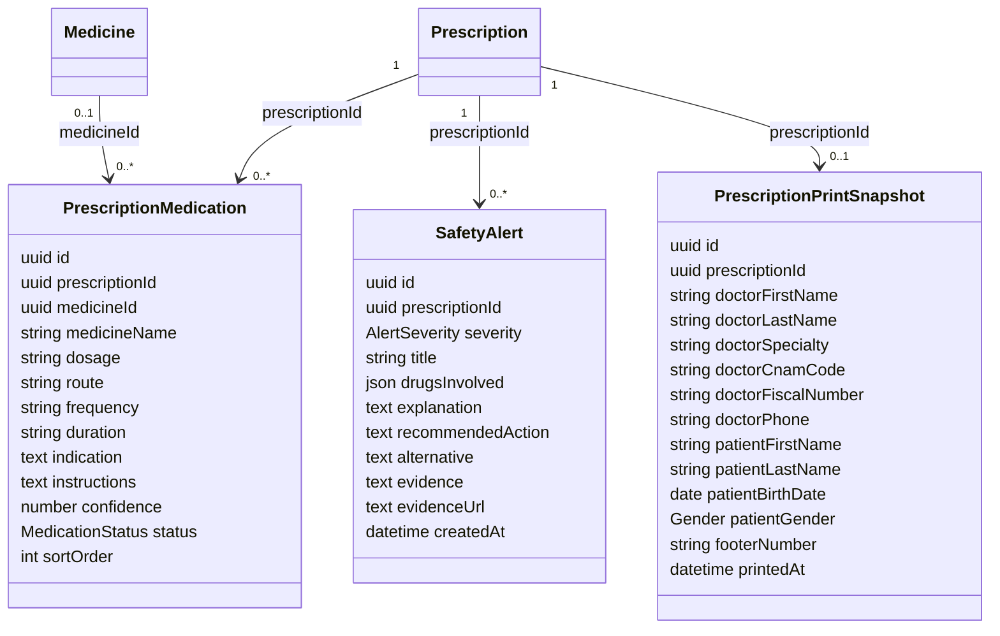

### Medicine Catalog

Current NestJS `medicines` is a **summary/catalog table**, not a one-to-one match for the FastAPI CDSS local product/formulary model.

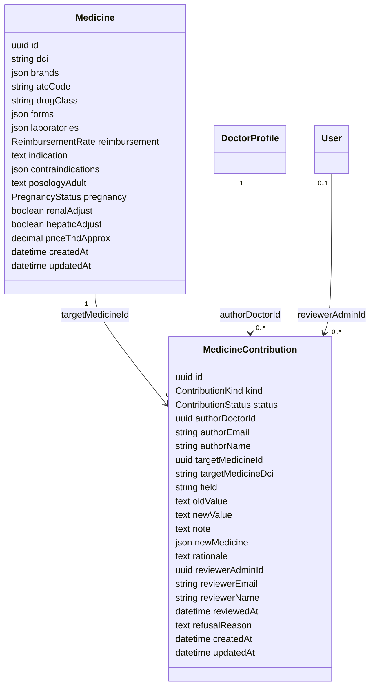

Recommended future table for alignment with FastAPI:

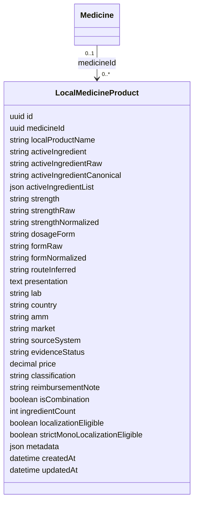

This is the missing table if NestJS must persist CDSS-localized product candidates.

### CMS And Public Engagement

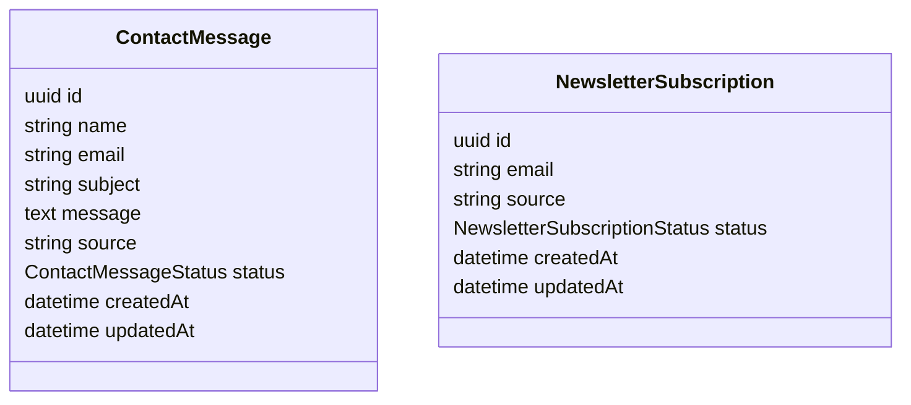

### Pharmacy, Audit, Interactions

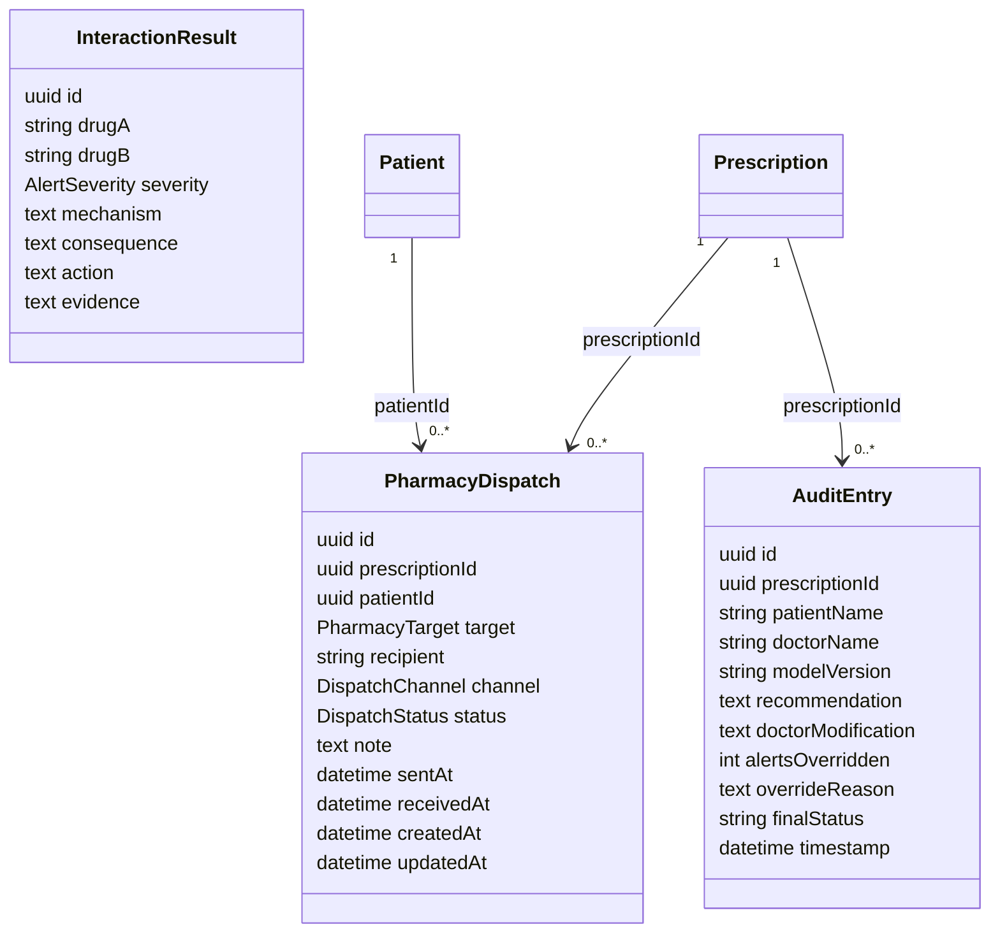

## FastAPI CDSS Contract Classes

FastAPI uses Pydantic models, not TypeORM tables, for runtime contracts.

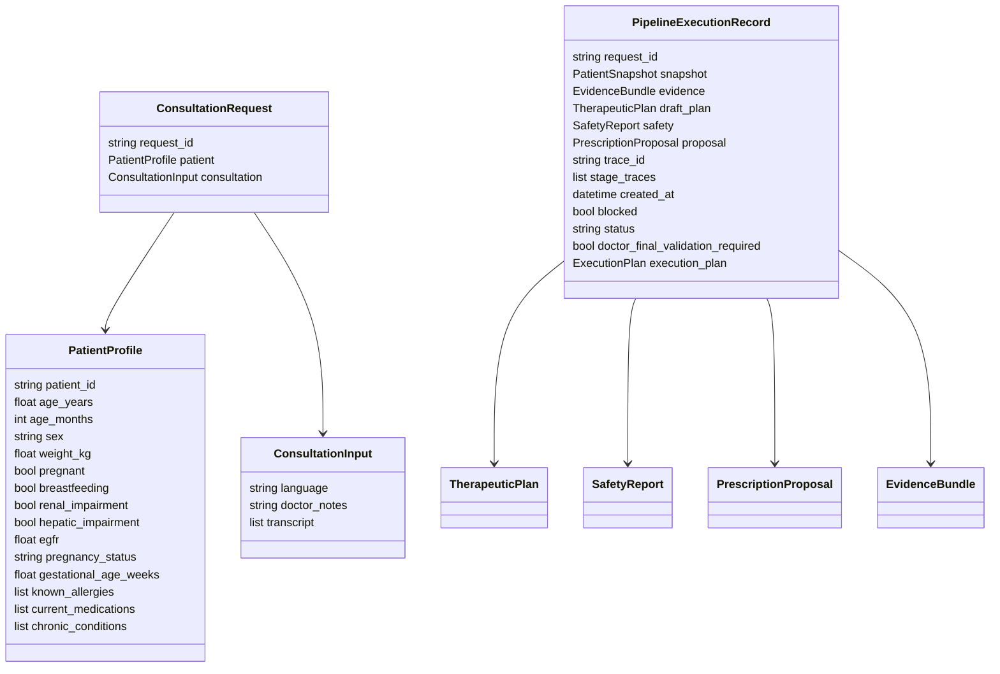

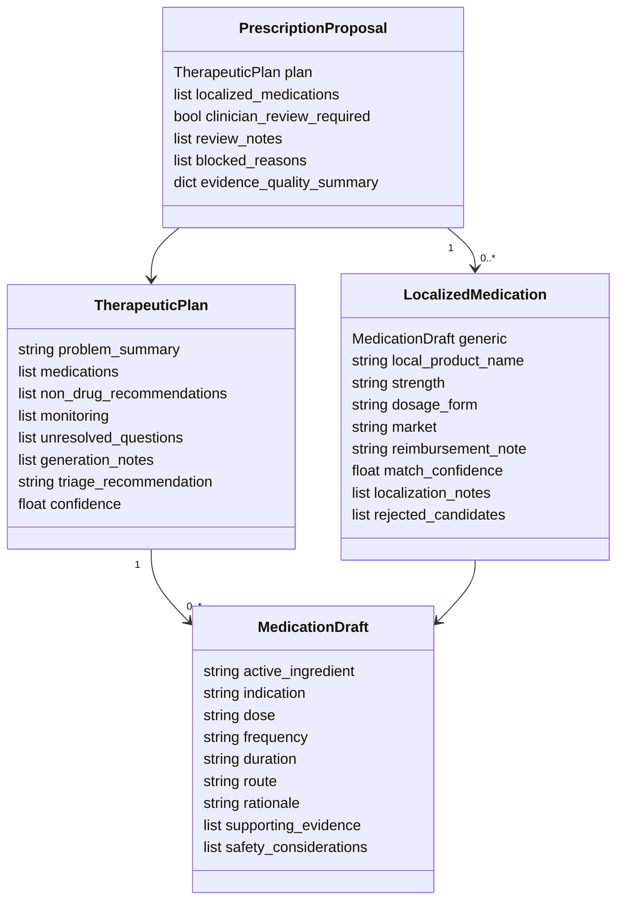

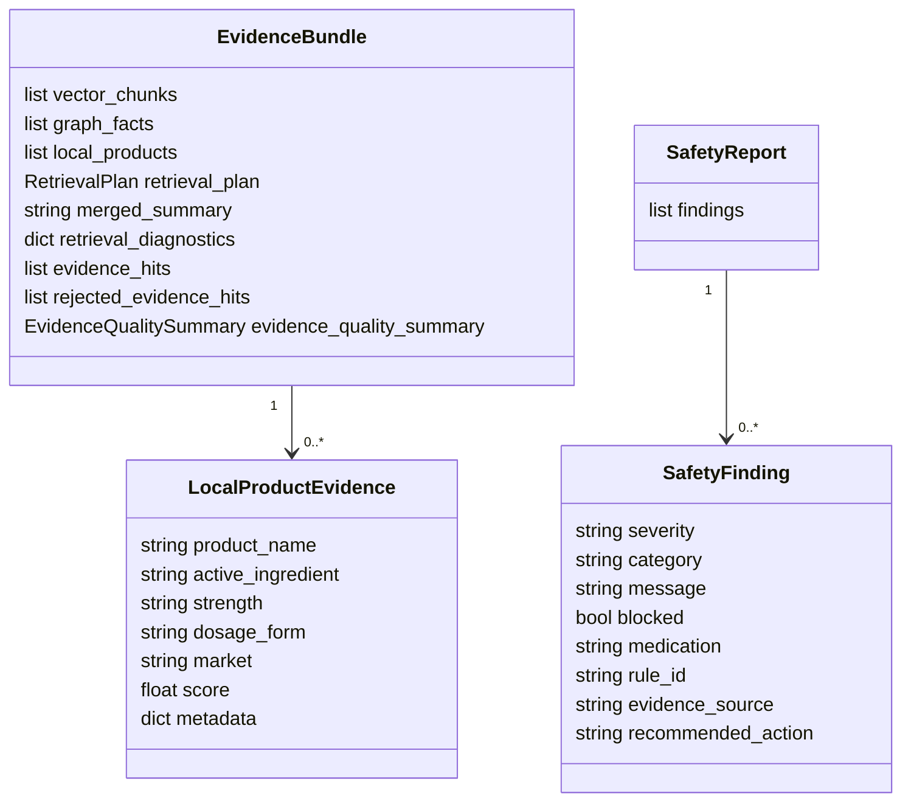

## NestJS To FastAPI Mapping

### Draft Prescription

NestJS request to FastAPI:

| NestJS app input | FastAPI field |
|---|---|
| `patientId` | `patient.patient_id` |
| `patientContext.ageYears` | `patient.age_years` |
| `patientContext.weightKg` | `patient.weight_kg` |
| `patientContext.allergies` | `patient.known_allergies` |
| `patientContext.currentMedications` | `patient.current_medications` |
| `patientContext.chronicConditions` | `patient.chronic_conditions` |
| `patientContext.egfr` | `patient.egfr` |
| `patientContext.renalImpairment` | `patient.renal_impairment` |
| `patientContext.hepaticImpairment` | `patient.hepatic_impairment` |
| `diagnosis + notes` | `consultation.doctor_notes` |
| `language` | `consultation.language` |

FastAPI draft response to NestJS persistence:

| FastAPI output | NestJS field/table |
|---|---|
| `trace_id` | `prescriptions.aiTraceId` |
| `status` | `prescriptions.aiStatus` |
| `blocked` | `prescriptions.aiBlocked` |
| `doctor_final_validation_required` / `proposal.clinician_review_required` | `prescriptions.aiReviewRequired` |
| full response | `prescriptions.aiPayload` |
| `draft_plan.problem_summary` | `prescriptions.diagnosis` fallback |
| `draft_plan.medications[].active_ingredient` | `prescription_medications.medicineName` |
| `draft_plan.medications[].dose` | `prescription_medications.dosage` |
| `draft_plan.medications[].frequency` | `prescription_medications.frequency` |
| `draft_plan.medications[].duration` | `prescription_medications.duration` |
| `draft_plan.medications[].route` | `prescription_medications.route` |
| `draft_plan.medications[].indication` | `prescription_medications.indication` |
| `draft_plan.medications[].rationale + safety_considerations` | `prescription_medications.instructions` |
| `safety.findings[]` | `safety_alerts[]` |

### Medicine/Formulary Mapping

NestJS `medicines` started as a DCI summary:

```text
One DCI summary -> many brands/forms/labs stored as arrays.
```

FastAPI CDSS local formulary:

```text
One local product candidate -> one active ingredient, strength, form, AMM, lab, market, metadata.
```

Therefore, **NestJS medicines and FastAPI LocalProductEvidence are not equivalent**.

The current implementation keeps `/api/medicines` stable, but enriches `medicines`
with Tunisian product-level fields from TN Med:

| TN Med / FastAPI product concept | NestJS `Medicine` field |
|---|---|
| `id_medicament` | `sourceMedicineId` |
| `cle_medicament` | `sourceKey` |
| `nom_medicament` / product name | `localProductName`, `brands[0]` |
| `dci_raw` / active ingredient | `dci` |
| `dosage` | `dosage` |
| `forme` | `form` |
| `presentation` | `presentation` |
| `laboratoire` | `laboratories[]` |
| `amm` | `amm` |
| `date_amm` | `ammDate` |
| `classe_therapeutique` | `drugClass` |
| `sous_classe_therapeutique` | `therapeuticSubclass` |
| `statut_gp` | `genericStatus` |
| `veic_status` | `veicStatus` |
| price fields | `publicPriceMinTnd`, `publicPriceMaxTnd`, `priceTndApprox` |
| reimbursement fields | `reimbursement`, `reimbursementCategory`, `reimbursementRatePercent`, `referenceTariffTnd` |
| `indications_raw` | `indication` |
| RCP/notice URLs | `rcpUrl`, `noticeUrl`, `detailUrl` |
| `sources_presentes` | `sourceSystems[]` |

### TN Med Kaggle Import

Dataset on EC2:

```text
/opt/cdss_system/data/tn-med-db-v1/database/TN_Med.db
```

The dataset was downloaded from Kaggle:

```text
islemtrigui6/tn-med-db-v1
```

Import script:

```bash
cd backend_template
npm run import:tn-med
```

Docker production import after deployment:

```bash
docker compose exec api npm run import:tn-med:prod
```

Required variables:

```text
TN_MED_SQLITE_PATH=/app/data/tn-med-db-v1/database/TN_Med.db
TN_MED_IMPORT_LIMIT=
```

`TN_MED_IMPORT_LIMIT` is optional and useful for quick smoke imports. Leave it
empty to import the full 6093-row medicines catalog.

## Current Alignment Status

| Area | Status | Notes |
|---|---|---|
| NestJS consumes FastAPI CDSS | Implemented | `CdssService` calls FastAPI using `CDSS_API_BASE_URL`; base URL may be root or `/v1` |
| Complete CDSS adapter contract from zip | Implemented | System, prescription, evidence, localization, search, audit, feedback, monitoring, and Kaggle worker helper routes are exposed under `/api/cdss` |
| CDSS execution modes | Implemented | `direct` calls FastAPI live; `kaggle` submits offline notebook worker jobs and fetches outputs |
| Draft prescription mapping | Implemented | FastAPI draft maps to NestJS prescription and medication rows |
| Safety finding mapping | Implemented | FastAPI safety maps to NestJS `safety_alerts` |
| Trace/audit reference | Implemented | FastAPI `trace_id` stored on NestJS prescription |
| Medicine product catalog | Implemented | `medicines` now stores TN Med product-level fields |
| TN Med SQLite import | Implemented | `npm run import:tn-med` imports Kaggle SQLite into NestJS DB |
| Full CDSS asset synchronization into NestJS DB | Partial | TN Med product catalog is imported; NestJS still queries FastAPI for CDSS reasoning |

## Recommended Next Implementation

1. Link `prescription_medications.medicineId` to the selected TN Med product when a doctor chooses a local product.
2. Add a dedicated product picker in prescription creation that searches `/api/medicines?search=...`.
3. Add optional import of detailed TN Med safety rules into separate review tables if clinicians need rule-level browsing.
4. Keep FastAPI responsible for prescription reasoning and evidence validation.
